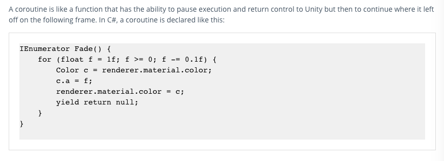
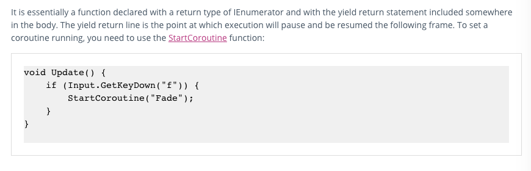
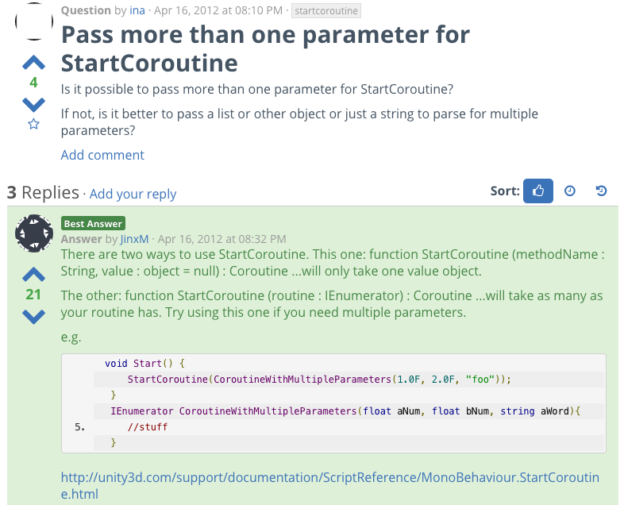
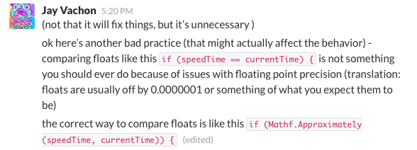

#Research Assignment
###VM 364
###Erica Salling

My game, ReBirth, is a strategy game based a grid of objects with which the player can potentially interact. At the beginning of the game, the map is randomly spawned with random numbers of different species and objects, each taking up a single grid space. The game is based around a 24-hour clock, and the behavior of different game objects at different time intervals, such as a day change. As the player plays the game, each action they take costs a certain amount of fuel and takes a certain amount of time to complete. The time costs come into play as the day changes, and objects react to this change. Reeds grow to adjecent squares, potentially destroying mangroves. Trash shifts around in the grid, with a 50% chance to destroy a mangrove if next to it. Mangroves spawn algae on the day change, and will stack algae up to three total. 

They day-night system for the game was completed prior to this class, and rotates a light and changes that light's intensity as the day goes on, to simulate a sun rising and setting. While most of the game is played top-down, I wanted to enable the player to experience the day changing and the environment in the 3D world from within it rather than above it. The player chooses a tile and is transported down to that tile, where they may then choose their action and watch what happens before being sent back to their bird's eye view. 

When a player chooses an action, a function is called to increase the speed of the clock for the amount of time required for that action. However, my problem arose when trying to get the function to wait for the clock to reach the end of it's time requirement, before switching back to the bird's eye view. In researching how to get a function to wait, I discovered coroutines. 

The way one writes a coroutine includes making a function with the class IEnumerator that will contain all of the code to be executed by the coroutine. This function will execute all of the contained code, and then return null.

A coroutine must be called only when the coroutine is null, which is declared at the end of a coroutine to end it. If developers want the coroutine to wait extra frames, they can use `yield return new WaitForEndOfFrame();` or `yield return new WaitForSeconds(.1f);` to wait a specific number of seconds. In my particular case, I only needed the coroutine to work as it normally functions, so I stuck with using `yield return null` at the end of mine, which I named Speed. 

In order to call my coroutine, I needed another function that would check if it was null, and then assign a coroutine variable to my IEnumerator class function Speed. I did not want to put my IEnumerator in Awake or Start, as it was in the Unity Manual, since this function would be called when the player clicks an action button. Instead, I opted to create a function on my TimeControl script that would call this IEnumerator. I was not sure at first if coroutines were able to take parameters such as floats, but discovered that they used parameters just like regular functions. In my researching, I also stumbled upon a way to pass multiple parameters into my IEnumerator function if I wanted or needed to. 

In the end, the most frustrating part about getting my coroutine to work perfectly (and it does) was something that had nothing to do with coroutines at all, but was nonetheless frustrating and worth noting here. In my coroutine, there is a while loop that as long as a bool speedDone is false, and otherwise increases the speed of time. The bool speedDone is set to true if the current time of day, which is constantly changing, is equal to the time at which the player took the action plus the time required by that action. My code below, seemed to make sense perfectly, and it worked the FIRST time. If I tried to take another action after that, however, the time would continue at rapid speed forever, and I was stuck watching it. 

Turns out, the only thing wrong was this little line of code below, which compared the two floats, speedTime and currentTime:

`if (speedTime == currentTime) {
	speedDone = true;
}`

After showing my code to Jay Vachon, junior developer at The Engagment Lab, I discovered that this was poor practice:

Although this has nothing to do with coroutines themselve, it was a vital learning point for me that enabled me to now have a flawless, time fast-forwarding coroutine. 