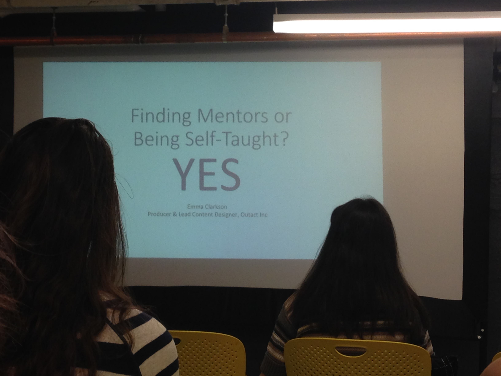

#WIG Meeting Event

##Presentation by Emma Clarkson
####Producer & Lead Content Designer, Outact Inc. 

First arriving at the Women In Games meeting, the entire event space was empty other than the rows of chairs and podium set up. Slowly, people started to trickle in, many of whom greeting people they recognize from past meetings. Many people start to form groups, chatting and sitting down together. Some others doodled and wrote their twitter handles on the whiteboard walls. 

Making friends with a group of students from Worcester Poly Tech, I sat and began to wait for the talk to begin. From conversations going on around me, I noticed that most people were either repeat-attendants of the meetings, or were with someone who was. As someone not only there by myself but also a first-time attendant, I was a black sheep. 

The talk started up, with Emma Clarkson, the speaker, taking the podium at the front of the room. The monitor setup was turned on, revealing the first slide of her presentation, which I had read would be about preparing for finding careers in the game design industry. 

The first slide was a very easy intrduction into what would be discussed that evening. "Mentor or Self Taught? YES" - it immediately gave the impression that we would be learning multiple ways to enter the industry. This seemed like a good sign to me, as I expect my path into the industry will differ greatly from many of those who are already in the industry and giving talks like these. 

The next slide was a basic discussion of who the presenter, Emma Clarkson, was, and what she did in the industry. As it turns out, she started as a Liberal Arts Major, very unsure of where to go with that degree. However, a great piece of advice that she gave was that she took this potentially limiting major, and turned it to make it limitless. She then turned to marketing, unsure of her product, and decided to start making *something*, even if it wasn't anything big or related to her marketing work. This something for Emma was a blog about video games she played, read news about, etc. 

This game review blog, though very informal, became what caught the eye of Emma's next big employer: Metaversal Studios. Emma also had a boring work blog about marketing, but the passion and writing seen in the game blog was what really made her stand out. 

Leaving that position and moving on to another studio, Emma experienced a "many hats" situation, more common in small, indie companies. Some questions arose on this topic by people in the audience, one man asking abouy any advice she could give to someone not sure what they are looking to go into in the industry - is wearing many hats a good way to figure that out? 

Emma's answer was one with many possible solutions, but the main idea was that yet - wearing many hats was a great way for her to feel out her strengths and weaknesses, work closely with people who did not share those strengths and weaknesses, and discover her niche. For some people, however, these many-hate positions could be their niche entirely, as some people work really well in small groups where holding multiple positions is not only recommended, it may be entirely necessary. 

After holding this many-hats position, Emma experienced her first company closure (and her own lay-off). This is something to always be prepared for in the industry, according to her story, as many companies start with funding and lose it, expect to get funding and never do, or something else in the financing narrative.

The next step in Emma's journey was going at it alone for a while, freelancing and working with people on different projects, some of which were in the game design industry, while some were not. Although these non-game related jobs were not as fun, they did help pay the bills and allow for time to work on the projects that were most interesting to Emma personally. 

The biggest piece of advice given here is to build bridges and never burn them. There was quite a bit of discussion around this topic, with many people asking advice for how to build briges, maintain those bridges, and even what to avoid so as to not burn them. Rash responses were number one on Emma's list of DON'Ts, explaining how many people misinterpret online interactions, but even if they don't, will often overreact and lose a potential client for the future. The proper response to rejection is always a "thank you" and "hope to work with you in the future."

Emma currently works at a company called Outact, which was actually one of her best freelancing clients. Due to her skilled networking and building/maintaining of bridges, Emma was able to not only land a job at the company with her skill set at the time, but proved herself passionate enough to be offered an actual game-design position -- what she always wanted to do in the first place!

Concluding thoughts from Emma are pretty self-explanatory after hearing the rest of her presentation, but they basically sum up with the minecraft crafting example - the sword's ingredients are shaped like a sword, and likewise with the axe. This represents how games make it easy on their players, and how we as game designers should apply these mechanics to our careers, planning for what we want to be, no matter the effort it may take to get there. 
