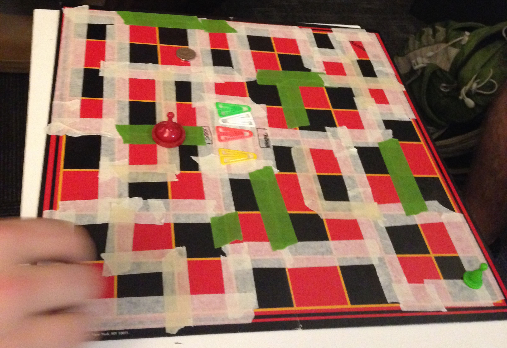
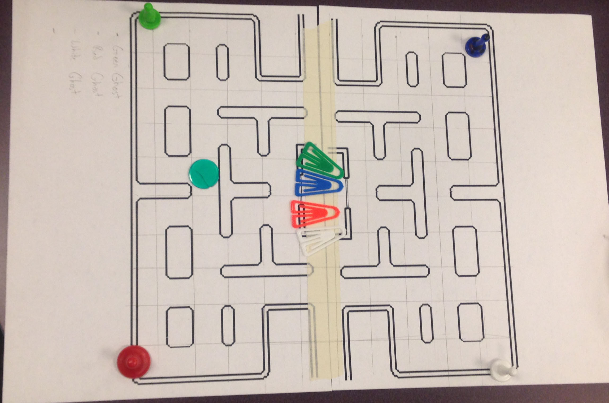

#PacMan vs Ghost
###Itterative Design Process
#####Designed by Savannah, Sean Cardwell, Paul MacCarty, and Erica Salling

######First Attempts
Our task was simple: find a way to "hack" the classic game, PacMan. To start this process, we first had to create the environment of PacMan as a paper-prototype. Taking the classic checkers board, we used tape to fashion a left-right symetrical maze; we used four colored paper-clips for ghosts, and a red thing for PacMan. 

We soon realized that it would be harder than we thought to prototype having four ghosts, especially since each had a different "trait" that determined how it moved:

- Green ghost moves three spaces in opposite direction, takes shortest path to Pacman
- Blue ghost takes shortest path to Pacman but never follows Green ghost
- Red ghost goes toward Pacman and nearest fruit
- White ghost takes shortest path to Pacman but impulsively turns left every 3 moves

As well as special powers that each ghost had:

- Green = Follows Green Path
- Blue = Can Jump Over 1 Square of Nothing (Wall)
- Red = Double Speed (Moves)
- White = Rotates Board Once Every 6 Turns

Everything was based on the  fruits, and which fruit "triggered" it's corresponding colored ghost to start eating the remaining fruit. Since the fruits were PacMan's goal, he would obviously try to stop the ghost before all fruits are eaten, and once caught any eaten fruits would be replaced where they were. This was a fun idea, but got difficult once there were five hands moving around the board, especially since the movement was controlled by dice. 

######Second Itteration

To change the pace of the game, the dice were removed and replaced by single-space movement and a turn-based system instead of everyone moving at the same time. We also got a new board to test out our new changes. 

At this point, our struggle was with the fact that this version of the game, though easier to move without die, simply was not fun. Even without the five hands moving around on the board, the game was complicated with each ghost's motives and powers, and started to become repetative regardless of how we tried to differentiate each ghost. 

There didn't seem to be anything within the game setup we had built, that, once changed, would alter how the game actually played. It would still be repetative, with too much AI and not enough player interaction. 

######Third Itteration

So, it came time for a change. In a last-minute decision, we ditched four ghosts for one, and made the game a two-player PacMan vs. Ghost interactive experience. Players either chose Ghost or PacMan, and played against one another. PacMan and Ghost moved at the same pace, two spaces, and PacMan always moved first. Ghost's goal was to eat all of the fruits, and PacMan's goal was to eat Ghost. 

The other big change about this itteration, was to change the powers that the Ghost had. Borrowing from one of our past ideas, in which the Green Ghost from our first itteration could move on special green paths, we set up a couple boards with different variations of colored paths. This way, the player could play a few different versions of the same game, just for a change of pace. 

The first thing that changed about this itteration after playing was the speed of the players, since immediately it was too easy for Ghost to win. PacMan's movement was increased, from two to three, so with the fruit's speed boost, PacMan would move six. 