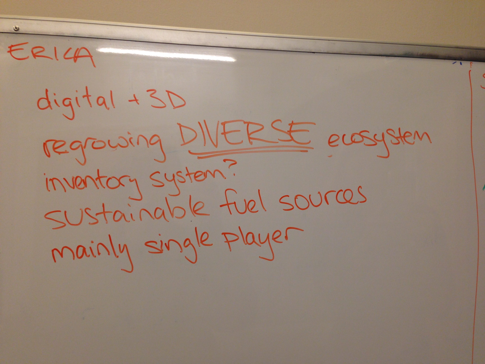
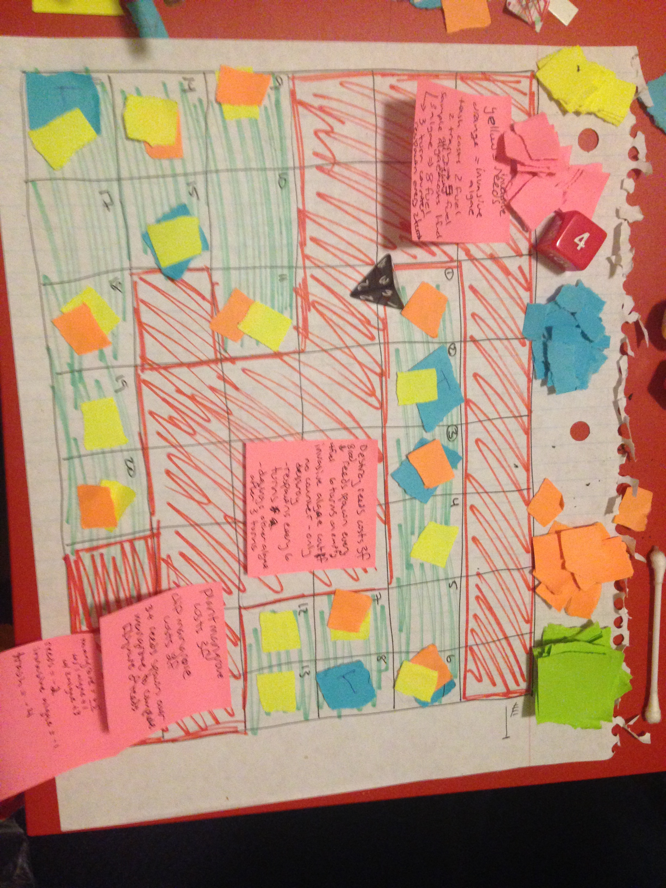
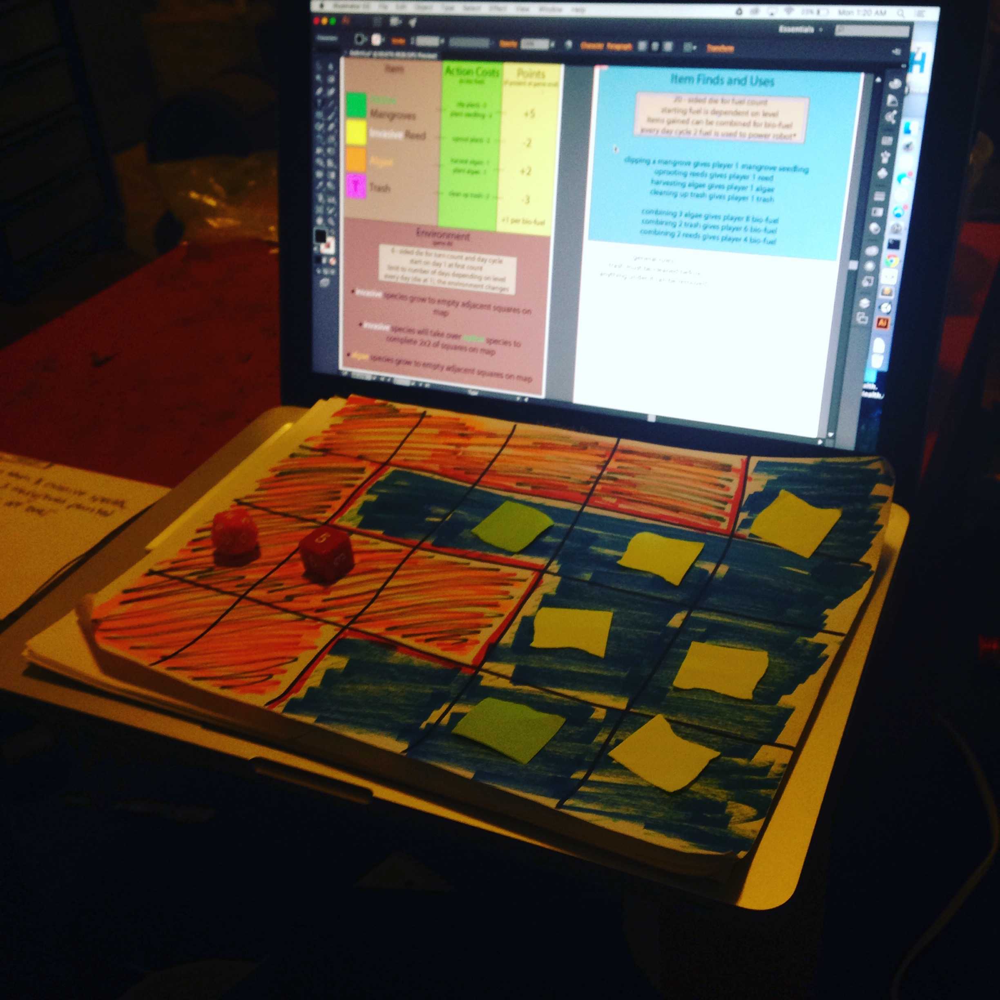

#ReBirth
##Erica Salling

ReBirth started as a simulation experience, dropping the player into a wasteland and asking them to survive while regrowing the environment. Through paper prototyping, it was clear that the gameplay did not have much motivation for the player, nor was it very much fun. This was mostly due to this "dropping the player," that allowed for too much to be done at once, without giving any sort of introduction. The area included multiple native and invasive species to grow and destroy, respectively, as well as trash and oil to collect for fuel conversion. The first step to working through these problems would be to cut down the list of resources within the game. Before even this, however, I worked out the major components of ReBirth, things about the game that were essential to it's game identity. These included a 3D world, inventory system, single player, and the emphasis on diversity and sustainable practices. This meant the game would first show the player how diversity effects environments and why its important, and then enable the player to continue diversifying through sustainable actions. 

####Version 1 

This first, revised version included Mangroves, Invasive Reeds, three species of Algae(two invasive, one native), and Trash. The goal of the game, given an area filled with invasive species and trash along with a few resources in the player's inventory, would be to regrow the area with mangroves. The end-goal was not clearly defined in this version of the game, simply requiring the "regrowth" of the area with native species. For prototyping, the game was set up as turn-based, indicated by the 6-sided die that represents the full day-cycle. At this point, nothing happened at the end of this day-cycle. Although this first version cut down on the initial list of resources available within the game, it was not enough to easily introduce the player to the game mechanics and concepts. A big turning point was narrowing down the algae to be only one species rather than a group. This was initially used as a way to show the player how diversity can be within species of organisms, but proved too confusing until much further into the game. 

I needed to focus the game further on a small group of components that could be templates for more complicated resources later in the game. 

####Version 2

Reducing the scope of the project even further, I began reducing the game to four main resources: mangroves, reeds, trash, and algae. In order to make this small scope work, I also began formulating simple rules in order to determine how the resources would respond to one another, react to the player, and effect the game evironment. The day-cycle became very important here, as it determined when these movements would occur. I also established a set day-limit for levels, so that players must complete an objective, even if that is just via high score, before their number of days has ended. 

- The invasive reeds were easy, they would grow each day-cycle, forcing the player to calculate and plan for their movement. I decided that the reeds wouldbe mostly annoying, unless in groups, and also set the rule that invasive reeds could take over mangroves to complete a 2x2 square. 

- The algae's rules were not much different from the reeds, though I did not want to make them nearly as destructive. Instead, the algae were designed as the main resource for making bio-fuel, which ran all actions. These were cheap to pick up, grew every day just like the reeds, and did no harm if left around. 

- The Mangroves at this stage did not have many rules, other than their unique ability to be "clipped" and planted on a later turn. This was the only way for the player to gather and grow their mangroves and ultimately win the game. 

- The Trash at this stage had no unique rules, but provided extra fuel for players. 

####Version 3

Playing the game myself and with my friends, I worked on establishing levels that slowly introduced the player to the different resources in the game, and their rules. The first level was all about trash clean-up and converting resources to bio-fuel for points. Next, I introduced the reeds, then the mangroves, and finally the algae. This resulted in 6 levels that the player would be required to play through before entering a "free mode" version of the game, in which the resources rules would form a seemingly never-ending puzzle for the player. 

The game would calculate points for the player based on remaining resources on the board at the day-limit, as well as any remaining bio-fuel. Mangroves are worth 5 points, reeds are -3, algae are +1, and trash are -4.

The finalized rules for the resources are as follows: 

- Mangroves spawn algae. They can be clipped for a seedling that can be planted later. 
- Trash are toxic, preventing growth for all but invasives on adjacent squares. Can destroy native species if adjacent on day-end. 
- Reeds grow to empty adjacent squares on day-end. They will destroy native species to complete a 2x2 square. 
- Algae can be extracted from mangroves upon "clipping." Will grow to random adjacent square on day-end. 

